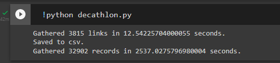

# Decathlon Data Analysis Project


# Project's Overview
1. <ins>Web Scraping</ins>
    * Created a [scraper](scraper/) package/directory to collect data from [Decathlon](https://www.decathlon.com/)'s online store.
2. Exploratory Data Analysis
    * EDA using the collected data from above.

# Project's Description
## 1. Web Scraping
### <ins>Task</ins>
* Scrape product data for `mens`, `womens`, `kids`, and `babies` categories.

### <ins>Problems</ins>
* **`One`**, the [site](https://www.decathlon.com/) was `too complex`, with `10k plus` of products and various sub-categories, making it even harder to navigate through pages from the `frontend`.
    

* **`Two`**, there were `way too many urls`. Waiting for each response to comeback and parse the reponse object respectively `might takes forever`.

### <ins>Solution</ins>
* **_For all of the product urls_**, I used the [page's sitemap](https://www.decathlon.com/sitemap.xml):
    * Get a `list of product urls` and loop through that list to extract the data that we wanted.
    ```html
    <sitemapindex>
        <sitemap>
            <loc>
                https://www.decathlon.com/sitemap_products_1.xml?from=8207731009&to=2066233163838
            </loc>
        </sitemap>
        <sitemap>
            <loc>
                https://www.decathlon.com/sitemap_products_2.xml?from=2066236014654&to=6550705406014
            </loc>
        </sitemap>
        <sitemap>
            <loc>
                https://www.decathlon.com/sitemap_products_3.xml?from=6550705471550&to=6968108580926
            </loc>
        </sitemap>
    </sitemapindex>
    ```
    * So, there are three **`sitemap_products`** pages in which all the product urls are contained.

* **_For the specific piece of information_**, [Decathlon](https://www.decathlon.com/)'s online store is based on **[Shopify](https://www.shopify.com/)** platform, which means I could add the **`.js`** or **`.json`** to the `end` of every `product urls` and retreive just the **`JSON data`** of the corresponding products.
    * For example: https://www.decathlon.com/products/mens-hiking-pants-nh100-308281.json

    | Product with its variants | Its first variant |
    | :---: | :---: |
    |  |  |

* **_For handling the large number of urls_**, we can apply `asynchronous` code:
    * Wait for all the responses to comeback.
    * Then execute the parsing code.

### <ins>Output</ins>
* I used **[Google Colab](https://research.google.com/colaboratory/)** for this task.

    | Execution time |
    | :---: |
    |  |

* Data's schema

    | Column's name | Description | Data type |
    | :---: | :--- | :---: |
    | `product_id` | product's id | int |
    | `variant_id` | id for every product variants | int |
    | `title` | product's name | str |
    | `created_at` | date when the product was add to Shopify | datetime |
    | `handle` | the last part of product's url | str |
    | `vendor` | product's supplier | str |
    | `type` | product's type | str |
    | `color`, `size`, `weight` | product's properties | str |
    | `price` | product's current price | float |
    | `compare_at_price` | product's previous price | float |
    | `available` | product's avalability | bool |
    | `inventory` | product's inventory if available | int |
    | `rating`, `five_star_reviews`, `total_reviews` | product's rating information | float, int |

## 2. Exploratory Data Analysis
Link to Google Colab Notebook